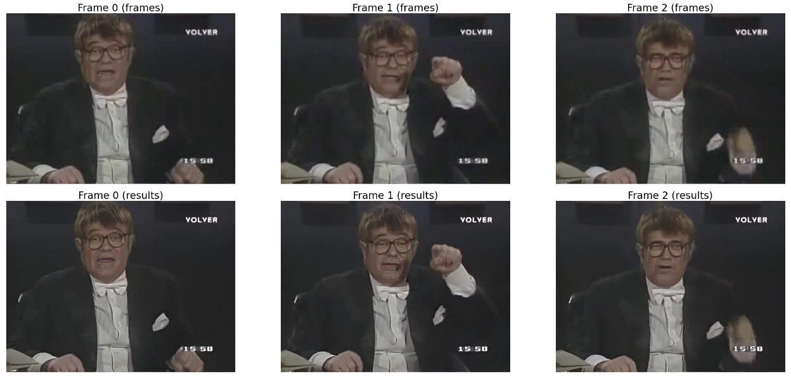

# Tutorial: "Towards Robust Blind Face Restoration with Codebook Lookup Transformer"

This repo shows a step by step tutorial on how to apply [this algorithm](https://arxiv.org/abs/2206.11253) to videos downloaded from YouTube in order to restore and improve the image quality and detail of the faces found in the frames. 


## Getting started
- [SageMaker StudioLab Explainer Video](https://www.youtube.com/watch?v=FUEIwAsrMP4)
- [Explainer Video about RealBasicVSR](https://www.youtube.com/watch?v=dpC71lWTkGw&list=PLWhCQi97dstk-n_W_Eh90b_7tLWayDqcr&index=3&ab_channel=machinelearnear)
- [Towards Robust Blind Face Restoration with Codebook Lookup Transformer](https://arxiv.org/abs/2206.11253)
- [CodeFormer Official Repo](https://github.com/sczhou/CodeFormer)
- [It Happened One Frame: incredibly accurate video content search with OpenAI CLIP](https://yiyixuxu.github.io/2022/06/12/It-Happened-One-Frame.html)

## Setup environment

You can follow this step by step tutorial either through Amazon SageMaker StudioLab, Google Colab, or on your own hardware. Please click in any of the links below to get started

[](https://studiolab.sagemaker.aws/import/github/machinelearnear/towards_robust_blind_face_restoration/blob/main/step_by_step.ipynb)
[](https://studiolab.sagemaker.aws/import/github/machinelearnear/towards_robust_blind_face_restoration/blob/main/step_by_step.ipynb)

In order to setup your SMSL environment, you will need to get a [SageMaker Studio Lab](https://studiolab.sagemaker.aws/) account. This is completely free and you don't need an AWS account. Because this is still in Preview and AWS is looking to reduce fraud (e.g., crypto mining), you will need to wait 1-3 days for your account to be approved. You can see [this video](https://www.youtube.com/watch?v=FUEIwAsrMP4&ab_channel=machinelearnear) for more information. Otherwise, you can also use [Google Colab](https://colab.research.google.com/) which provides free GPU compute (NVIDIA T4/K80).

## Download video from YT

We are going to be re-using some of YiYi Xu's code shown here [in this article](https://yiyixuxu.github.io/2022/06/12/It-Happened-One-Frame.html) and its [HF Space](https://huggingface.co/spaces/YiYiXu/it-happened-one-frame-2/blob/main/app.py).

```python
def process_video_parallel(video, skip_frames, dest_path, num_processes, process_number, **kwargs):
    cap = cv2.VideoCapture(video)
    frames_per_process = int(cap.get(cv2.CAP_PROP_FRAME_COUNT)) // (num_processes)
    count =  frames_per_process * process_number
    cap.set(cv2.CAP_PROP_POS_FRAMES, count)
    while count < frames_per_process * (process_number + 1) :
        ret, frame = cap.read()
        if not ret:
            break
        if count  % skip_frames == 0:
            filename =f"{dest_path}/{count:06d}.png"
            cv2.imwrite(filename, frame)
        count += 1
    cap.release()
```

```python
def vid2frames(url, sampling_interval=1, **kwargs):
    # create folder for extracted frames - if folder exists, delete and create a new one
    path_frames = create_dir('frames')

    # download the video 
    fps, video_location = download_video(url)
    if video_location is not None: 
        if fps is None: fps = 30
        skip_frames = int(fps * sampling_interval)
        if skip_frames == 0: skip_frames += 1
        print(f'video saved at: {video_location}, fps:{fps}, skip_frames: {skip_frames}')
        # extract video frames at given sampling interval with multiprocessing - 
        n_workers = min(os.cpu_count(), 12)        
        
        with Pool(n_workers) as pool:
            pool.map(partial(process_video_parallel, video_location, skip_frames, path_frames, n_workers), range(n_workers))
    else:
        skip_frames, path_frames = None, None
        
    return (fps, video_location, path_frames)
```

We set `sampling_interval` to `0` in order to sample all frames in a video.

```python
fps, video_location, path_frames = vid2frames(youtube_url, sampling_interval=0)
```

## Run model inference on all frames

```python
def process_frame_parallel(img_path):
    # clean all the intermediate results to process the next image
    face_helper.clean_all()

    img_name = os.path.basename(img_path)
    # print(f'Processing: {img_name}')
    basename, ext = os.path.splitext(img_name)
    img = cv2.imread(img_path, cv2.IMREAD_COLOR)

    if args.has_aligned: 
        # the input faces are already cropped and aligned
        img = cv2.resize(img, (512, 512), interpolation=cv2.INTER_LINEAR)
        face_helper.cropped_faces = [img]
    else:
        face_helper.read_image(img)
        # get face landmarks for each face
        num_det_faces = face_helper.get_face_landmarks_5(
            only_center_face=args.only_center_face, resize=640, eye_dist_threshold=5)
        # print(f'\tdetect {num_det_faces} faces')
        # align and warp each face
        face_helper.align_warp_face()

    # face restoration for each cropped face
    for idx, cropped_face in enumerate(face_helper.cropped_faces):
        # prepare data
        cropped_face_t = img2tensor(cropped_face / 255., bgr2rgb=True, float32=True)
        normalize(cropped_face_t, (0.5, 0.5, 0.5), (0.5, 0.5, 0.5), inplace=True)
        cropped_face_t = cropped_face_t.unsqueeze(0).to(device)

        try:
            with torch.no_grad():
                output = net(cropped_face_t, w=w, adain=True)[0]
                restored_face = tensor2img(output, rgb2bgr=True, min_max=(-1, 1))
            del output
            torch.cuda.empty_cache()
        except Exception as error:
            print(f'\tFailed inference for CodeFormer: {error}')
            restored_face = tensor2img(cropped_face_t, rgb2bgr=True, min_max=(-1, 1))

        restored_face = restored_face.astype('uint8')
        face_helper.add_restored_face(restored_face)

    # paste_back
    if not args.has_aligned:
        # upsample the background
        if bg_upsampler is not None:
            # Now only support RealESRGAN for upsampling background
            bg_img = bg_upsampler.enhance(img, outscale=args.upscale)[0]
        else:
            bg_img = None
        face_helper.get_inverse_affine(None)
        # paste each restored face to the input image
        restored_img = face_helper.paste_faces_to_input_image(upsample_img=bg_img, draw_box=args.draw_box)

    # save restored img
    if not args.has_aligned and restored_img is not None:
        save_restore_path = os.path.join(result_root, 'final_results', f'{basename}.png')
        imwrite(restored_img, save_restore_path)
```

We then run this in parallel

```python
from tqdm.contrib.concurrent import process_map, thread_map  # or thread_map

original_frames = sorted(glob.glob(f'{path_frames}/*.png'))
results = thread_map(process_frame_parallel, original_frames), max_workers=1)
```

## Reconstruct frames into a video

```python
restored_frames = sorted(glob.glob(f'{result_root}/final_results/*.png'))
img_array = thread_map(read_image, restored_frames)
```

```python
generated_video_no_audio = f'videos/{Path(video_location).stem}_restored_no_audio.mp4'
generated_video = f'videos/{Path(video_location).stem}_restored.mp4'

img = cv2.imread(restored_frames[0])
height, width, layers = img.shape
size = (width, height)

out = cv2.VideoWriter(generated_video_no_audio, cv2.VideoWriter_fourcc(*'mp4v'), fps, size)
 
for i in tqdm(range(len(img_array))):
    out.write(img_array[i])
    
out.release()
```

Finally, we use `ffmpeg` to combine several audio and video files into one as [described in this article](https://www.arj.no/2021/05/11/ffmpeg-audio-video/).

```python
# source: 
!ffmpeg -i $video_location -i $generated_video_no_audio -c copy -map 1:v:0 -map 0:a:0 -shortest $generated_video
```

## Results



## References

```
@article{zhou2022codeformer,
    author = {Zhou, Shangchen and Chan, Kelvin C.K. and Li, Chongyi and Loy, Chen Change},
    title = {Towards Robust Blind Face Restoration with Codebook Lookup TransFormer},
    journal = {arXiv preprint arXiv:2206.11253},
    year = {2022}
}
```

## Disclaimer
- The content provided in this repository is for demonstration purposes and not meant for production. You should use your own discretion when using the content.
- The ideas and opinions outlined in these examples are my own and do not represent the opinions of AWS.